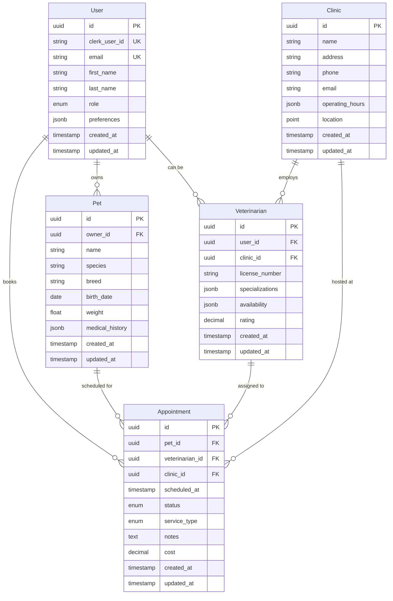

# Design Document

## Overview

The vet-core-package is designed as a foundational Python package that provides shared data models, database utilities, and validation schemas for the entire veterinary clinic platform. The package follows modern Python packaging standards and uses SQLAlchemy 2.0 with async support for database operations. It's structured to be lightweight, well-documented, and easily consumable by other services while maintaining strict data integrity and performance optimization.

## Architecture

### Package Structure
```
vet-core/
├── src/
│   └── vet_core/
│       ├── __init__.py
│       ├── models/
│       │   ├── __init__.py
│       │   ├── base.py
│       │   ├── user.py
│       │   ├── pet.py
│       │   ├── appointment.py
│       │   ├── clinic.py
│       │   └── veterinarian.py
│       ├── schemas/
│       │   ├── __init__.py
│       │   ├── user.py
│       │   ├── pet.py
│       │   ├── appointment.py
│       │   └── clinic.py
│       ├── database/
│       │   ├── __init__.py
│       │   ├── connection.py
│       │   └── session.py
│       ├── utils/
│       │   ├── __init__.py
│       │   ├── datetime_utils.py
│       │   ├── validation.py
│       │   └── config.py
│       └── exceptions/
│           ├── __init__.py
│           └── core_exceptions.py
├── tests/
├── alembic/
├── pyproject.toml
├── README.md
└── CHANGELOG.md
```

### Technology Stack
- **SQLAlchemy 2.0**: Modern ORM with async support and improved type hints
- **Pydantic v2**: Fast data validation and serialization with excellent performance
- **Alembic**: Database migration management integrated with SQLAlchemy
- **PostgreSQL**: Primary database with advanced features like JSONB and full-text search
- **asyncpg**: High-performance async PostgreSQL driver
- **Python 3.11+**: Modern Python with improved performance and type hints

## Components and Interfaces

### Database Models Layer

#### Base Model
All models inherit from a common base class that provides:
- Primary key (UUID-based for distributed systems)
- Audit fields (created_at, updated_at, created_by, updated_by)
- Soft delete capability (deleted_at, is_deleted)
- Common query methods and utilities

#### Core Entity Models

**User Model**
- Supports multiple authentication providers (Clerk integration)
- Role-based access control with enum-based roles
- Profile information and preferences
- Relationship to owned pets and clinic associations

**Pet Model**
- Comprehensive pet information (name, breed, species, age, weight)
- Medical history and vaccination records
- Owner relationship with support for multiple owners
- Photo storage references and identification details

**Appointment Model**
- Flexible scheduling system with datetime handling
- Service type categorization (checkup, emergency, grooming)
- Status tracking (scheduled, confirmed, completed, cancelled)
- Relationships to pet, veterinarian, and clinic

**Clinic Model**
- Location and contact information
- Service offerings and specialties
- Operating hours and availability
- Staff relationships and administrative details

**Veterinarian Model**
- Professional credentials and specializations
- Clinic associations and availability schedules
- Rating and review aggregation
- License and certification tracking

### Validation Schemas Layer

#### Request/Response Schemas
Each model has corresponding Pydantic schemas for:
- **Create schemas**: Required fields for entity creation
- **Update schemas**: Optional fields for partial updates
- **Response schemas**: Safe data serialization excluding sensitive information
- **List schemas**: Optimized schemas for collection endpoints

#### Custom Validators
- Email format validation with domain restrictions
- Phone number formatting and validation
- Date/time validation with timezone handling
- File upload validation for images and documents

### Database Connection Layer

#### Async Engine Management
- Connection pooling with configurable pool sizes
- Health check mechanisms and connection retry logic
- Environment-specific configuration management
- Graceful shutdown and cleanup procedures

#### Session Management
- Async session factory with proper lifecycle management
- Transaction context managers for atomic operations
- Error handling and rollback mechanisms
- Connection sharing for batch operations

### Utility Functions Layer

#### DateTime Utilities
- Timezone-aware datetime handling
- Business hours calculation for clinics
- Appointment scheduling helpers
- Age calculation and formatting

#### Validation Helpers
- Common validation patterns for veterinary data
- Data sanitization and normalization
- Custom validation decorators
- Error message standardization

#### Configuration Management
- Environment variable handling with type conversion
- Database URL parsing and validation
- Feature flag management
- Logging configuration utilities

## Data Models

### Entity Relationship Design



### Database Constraints and Indexes

#### Primary Constraints
- UUID primary keys for all entities
- Unique constraints on email addresses and license numbers
- Foreign key constraints with appropriate cascade behaviors
- Check constraints for data integrity (positive weights, valid dates)

#### Performance Indexes
- Composite indexes on frequently queried combinations (pet_id + scheduled_at)
- Partial indexes for active records (WHERE deleted_at IS NULL)
- GIN indexes for JSONB fields (medical_history, preferences)
- Spatial indexes for location-based queries

## Error Handling

### Exception Hierarchy
```python
VetCoreException (Base)
├── DatabaseException
│   ├── ConnectionException
│   ├── TransactionException
│   └── MigrationException
├── ValidationException
│   ├── SchemaValidationException
│   └── BusinessRuleException
└── ConfigurationException
    ├── DatabaseConfigException
    └── EnvironmentException
```

### Error Response Standards
- Consistent error message formatting
- Error codes for programmatic handling
- Detailed logging for debugging
- User-friendly error messages for client applications

### Retry and Recovery Mechanisms
- Database connection retry with exponential backoff
- Transaction retry for deadlock scenarios
- Graceful degradation for non-critical operations
- Circuit breaker patterns for external dependencies

## Testing Strategy

### Unit Testing Approach
- Comprehensive model testing with factory patterns
- Schema validation testing with edge cases
- Database utility testing with mocked connections
- Utility function testing with property-based testing

### Integration Testing
- Database integration tests with test containers
- Migration testing with schema validation
- End-to-end package installation testing
- Performance testing for query optimization

### Test Data Management
- Factory classes for creating test entities
- Fixture management for consistent test data
- Database cleanup and isolation between tests
- Mock data generation for various scenarios

### Continuous Integration
- Automated testing on multiple Python versions
- Database compatibility testing (PostgreSQL versions)
- Package building and installation verification
- Code quality checks and security scanning

## Package Distribution

### PyPI Publishing Strategy
- Semantic versioning with clear release notes
- Automated publishing through GitHub Actions
- Pre-release versions for testing and validation
- Dependency management with version pinning

### Documentation and Examples
- Comprehensive API documentation with Sphinx
- Usage examples for common patterns
- Migration guides for version updates
- Best practices and troubleshooting guides

### Version Compatibility
- Backward compatibility guarantees for minor versions
- Clear deprecation warnings and migration paths
- Support matrix for Python and database versions
- Dependency update policies and security patches